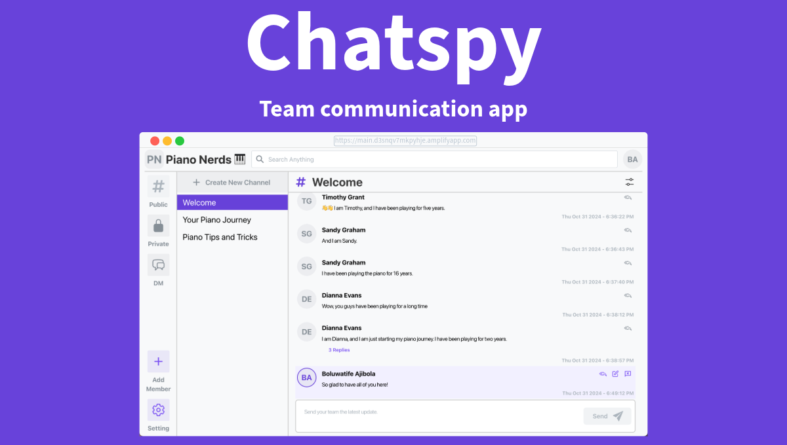

### Project Description

**[Chatspy](https://main.d3snqv7mkpyhje.amplifyapp.com/)** is an app that aims to help teams and communities have all their conversations in one place.

### Project Demo

https://github.com/user-attachments/assets/5b984ab2-485c-469a-8967-2efef964ff82

I apologize for the low video frame rate.

### How To Use Chatspy

#### Signing up and logging in

In order to use [Chatspy](https://main.d3snqv7mkpyhje.amplifyapp.com/), you must have an account. You can create an account by going to the sign-up page and providing the required information.

> When signing up, make sure the email you are using is valid in other to successfully create an account.

#### Signing up

https://github.com/user-attachments/assets/4500ccfc-78b0-4924-8e50-9d74edfe9200

#### Logging in

https://github.com/user-attachments/assets/6b0fdb4b-a623-44e0-84fc-b53f0fa46d76

#### Sign out

You can easily sign-out of the app by click the avatar icon at the top right corner of page and click `sign out`.

https://github.com/user-attachments/assets/9cbb3520-a2b4-4d71-b2e8-13dbc8e4215d

#### Create or join a workspace

Once you have signed up or logged in, you will be redirected to the workspace hub page.

#### Creating a workspace

In the workspace hub page, you can create a new workspace.

https://github.com/user-attachments/assets/a63156d4-0d30-4404-bbd3-4f668fbe748c

#### Join a workspace via email

If you are joining a workspace, you can give the admin your email so they can add you.

https://github.com/user-attachments/assets/16c1384b-e81f-4531-8095-d6f0eee610ea

#### Join a workspace via share link

You can also join a workspace via a share link. This is provided by the admin.

https://github.com/user-attachments/assets/f9e0add6-253e-4b70-a157-41770f13a7e9

#### Public Channels

Public channels are visible to all members in a workspace.

https://github.com/user-attachments/assets/cf8564d7-3265-4ccd-b1b4-76f1f42e4584

#### Private Channels

Private channels are visible to those who tha admin has added.

https://github.com/user-attachments/assets/65d1d55a-2310-433a-9ba4-8e890d8b12f6

#### Direct Message Channels

This channel type is a way to have one on one conversations between members of a workspace.

https://github.com/user-attachments/assets/709deaf1-f178-4611-aff9-a41eb51124cc

#### Workspace Settings

As a workspace admin, you have access to some setting like renaming your workspace.

You can also remove a member form a workspace.

#### Delete a workspace

> The action of deleting a workspace can not be undone.

#### User Settings
